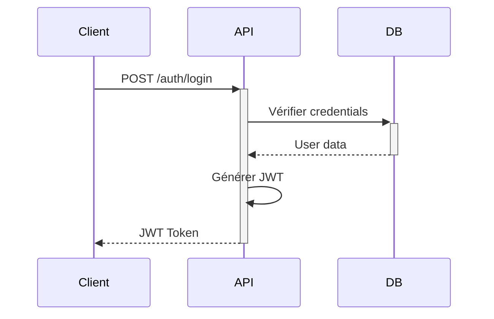
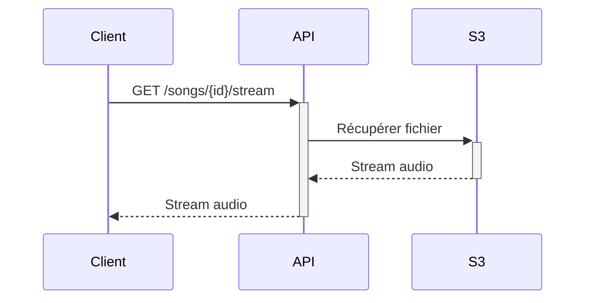
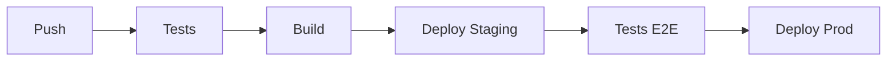

# Architecture du Projet

Ce document décrit l'architecture technique de Spotifake.

## Vue d'ensemble

Spotifake est construit avec une architecture moderne et scalable :

```
frontend/                 # Application Next.js
├── app/                 # Routes et composants
├── components/          # Composants réutilisables
├── lib/                 # Utilitaires et hooks
└── public/             # Assets statiques

backend/                  # API Node.js
├── src/
│   ├── controllers/    # Logique métier
│   ├── models/        # Modèles de données
│   ├── routes/        # Définition des routes
│   ├── services/      # Services métier
│   └── utils/         # Utilitaires
└── prisma/            # Schémas et migrations

shared/                   # Code partagé
├── types/             # Types TypeScript
└── constants/         # Constants partagées
```

## Stack Technique

### Frontend
- **Next.js** : Framework React avec SSR
- **TailwindCSS** : Styling
- **React Query** : Gestion des états et cache
- **Zustand** : État global
- **React Hook Form** : Gestion des formulaires

### Backend
- **Node.js** : Runtime JavaScript
- **Express** : Framework web
- **Prisma** : ORM
- **PostgreSQL** : Base de données
- **JWT** : Authentification

### Infrastructure
- **Vercel** : Hébergement et déploiement
- **AWS S3** : Stockage des fichiers
- **Redis** : Cache (optionnel)
- **GitHub Actions** : CI/CD

## Composants Principaux

### 1. Authentification



### 2. Lecture de musique



### 3. Gestion des playlists

- Création/modification via l'API
- Mise à jour en temps réel avec WebSocket
- Cache des playlists populaires

## Sécurité

1. **Authentification**
   - JWT avec rotation des tokens
   - Refresh tokens
   - Protection CSRF

2. **Autorisation**
   - RBAC (Role-Based Access Control)
   - Middleware de vérification des permissions

3. **Protection des données**
   - Chiffrement des données sensibles
   - Validation des entrées
   - Rate limiting

## Performance

### Optimisations Frontend

1. **Chargement**
   - Code splitting automatique
   - Lazy loading des images
   - Prefetching des routes

2. **Cache**
   - Cache des requêtes avec React Query
   - Service Worker pour le mode hors ligne
   - Cache local pour les préférences

### Optimisations Backend

1. **Base de données**
   - Indexation optimisée
   - Query caching
   - Connection pooling

2. **API**
   - Compression gzip
   - Cache Redis
   - Pagination

## Monitoring et Logging

### Outils de monitoring
- Sentry pour le tracking d'erreurs
- New Relic pour les performances
- Datadog pour les métriques

### Logs
- Winston pour le logging
- Rotation des logs
- Niveau de log configurable

## Scalabilité

### Horizontal Scaling
- Load balancing avec Nginx
- Sessions distribuées
- Cache distribué

### Vertical Scaling
- Optimisation des requêtes
- Gestion de la mémoire
- Configuration des workers

## Tests

### Frontend
- Jest pour les tests unitaires
- React Testing Library
- Cypress pour l'E2E

### Backend
- Jest pour les tests unitaires
- Supertest pour les tests d'API
- Tests d'intégration avec base de données de test

## Déploiement

### Pipeline CI/CD


### Environnements
- Development
- Staging
- Production

## Maintenance

### Mises à jour
- Dépendances mises à jour régulièrement
- Migrations de base de données
- Déploiements sans interruption

### Backup
- Backup quotidien de la base de données
- Réplication des fichiers S3
- Plan de reprise d'activité 